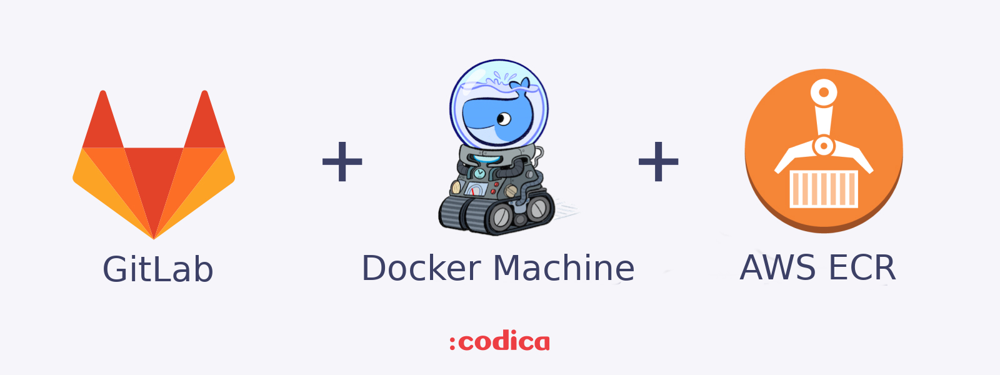

<h1 align="center">Autoscaling GitLab Runner on AWS with ECR authentication</h1>



If you want to have a cost-effective and scalable solution for you CI/CD, it can be useful to use Gitlab Runner with its autoscaling feature.
In this example, we'll show how to configure a Gitlab Runner in AWS that will serve as the bastion where it will spawn new Docker machines on demand.

## Prerequisites 

We will use such tools as:
* [Gitlab Runner](https://docs.gitlab.com/runner/)
* [Amazon’s EC2 Spot Instances](https://aws.amazon.com/ec2/spot/) 
* [Docker Machine](https://docs.docker.com/machine/drivers/aws/)

## Prepare the bastion instance
The first step is to install GitLab Runner in an EC2 instance that will serve as the bastion that spawns new machines. This doesn’t have to be a powerful machine since it will not run any jobs itself, a t2.micro instance will do. This machine will be a dedicated host since we need it always up and running, thus it will be the only standard cost.

Security Group for Bastion host must contain ingress rule for 2376 port

To create EC2 instance with all depencies installed - paste this into User Data 
```
#!/bin/bash
sudo apt-get update
sudo apt-get upgrade
sudo apt-get install -y apt-transport-https ca-certificates curl software-properties-common
curl -fsSL https://download.docker.com/linux/ubuntu/gpg | sudo apt-key add -
add-apt-repository \
   "deb [arch=amd64] https://download.docker.com/linux/ubuntu \
   $(lsb_release -cs) \
   stable"
sudo apt-get update
sudo apt-get install -y docker-ce
sudo usermod -aG docker ubuntu
sudo apt-get install awscli
sudo apt-get install golang-go
export GOPATH=$HOME/go
export PATH=$PATH:$GOPATH/bin
curl -L https://github.com/docker/compose/releases/download/1.21.0/docker-compose-$(uname -s)-$(uname -m) -o /usr/local/bin/docker-compose
chmod +x /usr/local/bin/docker-compose
base=https://github.com/docker/machine/releases/download/v0.16.0 &&
  curl -L $base/docker-machine-$(uname -s)-$(uname -m) >/tmp/docker-machine &&
  sudo mv /tmp/docker-machine /usr/local/bin/docker-machine &&
  chmod +x /usr/local/bin/docker-machine
curl -L https://packages.gitlab.com/install/repositories/runner/gitlab-runner/script.deb.sh | sudo bash
sudo apt-get install gitlab-runner

```
## Configure GitLab Runner

Now go to your bastion host and run ``` sudo gitlab-runner register ``` 
Paste settings from Your GitLab project. It will generate file with token we needed for our runner.

Then run ``` sudo vim /etc/gitlab-runner/config.toml ``` copy generated token to buffer and paste here new config


```
concurrent = 10
check_interval = 0

[[runners]]
  name = "REW TEST Runner"
  limit = 10
  url = "https://gitlab.codica.com/"
  token = "__TOKEN FROM PREVIOUS config.toml__"
  executor = "docker+machine"
  [runners.docker]
    tls_verify = false
    image = "alpine"
    privileged = true
    disable_cache = true
    volumes = ["/var/run/docker.sock:/var/run/docker.sock", "/cache"]
    shm_size = 0
  [runners.cache]
    Type = "s3"
    Path = "cache"
    [runners.cache.s3]
      ServerAddress = "s3.amazonaws.com"
      AccessKey = "XXXXXXXXX"
      SecretKey = "XXXXXXXXX"
      BucketName = "XXXXXXXX"
      BucketLocation = "eu-central-1"
  [runners.machine]
    IdleCount = 3
    IdleTime = 300
    MaxBuilds = 10
    MachineDriver = "amazonec2"
    MachineName = "gitlab-docker-machine-%s"
    MachineOptions = ["amazonec2-access-key=XXXXXXXXX", "amazonec2-secret-key=XXXXXXXXX", "amazonec2-region=eu-central-1", "amazonec2-vpc-id=vpc-0163a66b", "amazonec2-subnet-id=subnet-c6908bbb", "amazonec2-zone=b", "amazonec2-tags=runner-manager-name,gitlab-aws-autoscaler,gitlab,true,gitlab-runner-autoscale,true", "amazonec2-security-group=SSH Bastion Group", "amazonec2-instance-type=t3.medium", "amazonec2-request-spot-instance=true", "amazonec2-spot-price=0.05"]
    OffPeakPeriods = ["* * 0-8,22-23 * * mon-fri *", "* * * * * sat,sun *"]
    OffPeakTimezone = "Europe/Kiev"
    OffPeakIdleCount = 0
    OffPeakIdleTime = 1200

```
## ECR login stage

The next step is configure our AWS account ``` sudo aws configure ```
Then go to  ```sudo crontab -e ``` and paste it into: 
``` 0 */6 * * * RESULT=$(aws ecr get-login --no-include-email --region eu-central-1) && $RESULT >/dev/null 2>&1 ```

[Read the official documentation](https://docs.gitlab.com/runner/configuration/runner_autoscale_aws/#introduction) about Autoscaling GitLab Runner on AWS.

## License
Copyright © 2015-2019 Codica. It is released under the [MIT License](https://opensource.org/licenses/MIT).

## About Codica

[](https://www.codica.com)

The names and logos for Codica are trademarks of Codica.

We love open source software! See [our other projects](https://github.com/codica2) or [hire us](https://www.codica.com/) to design, develop, and grow your product.


